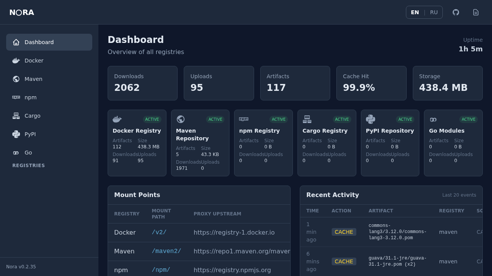

# NORA

**The artifact registry that grows with you.** Starts with `docker run`, scales to enterprise.

```bash
docker run -d -p 4000:4000 -v nora-data:/data ghcr.io/getnora-io/nora:latest
```

Open [http://localhost:4000/ui/](http://localhost:4000/ui/) — your registry is ready.

<p align="center">
  
</p>

## Why NORA

- **Zero-config** — single 32 MB binary, no database, no dependencies. `docker run` and it works.
- **Production-tested** — Docker, Maven, npm, PyPI, Cargo, Raw. Used in real CI/CD with ArgoCD, Buildx cache, and air-gapped environments.
- **Secure by default** — [OpenSSF Scorecard 7.1](https://scorecard.dev/viewer/?uri=github.com/getnora-io/nora), signed releases, SBOM, fuzz testing, 200+ unit tests.

**32 MB** binary | **< 100 MB** RAM | **3s** startup | **6** registries

> Used in production at [DevIT Academy](https://github.com/devitway) since January 2026 for Docker images, Maven artifacts, and npm packages.

## Supported Registries

| Registry | Mount Point | Upstream Proxy | Auth |
|----------|------------|----------------|------|
| Docker Registry v2 | `/v2/` | Docker Hub, GHCR, any OCI | ✓ |
| Maven | `/maven2/` | Maven Central, custom | ✓ |
| npm | `/npm/` | npmjs.org, custom | ✓ |
| Cargo | `/cargo/` | — | ✓ |
| PyPI | `/simple/` | pypi.org, custom | ✓ |
| Raw files | `/raw/` | — | ✓ |

## Quick Start

### Docker (Recommended)

```bash
docker run -d -p 4000:4000 -v nora-data:/data ghcr.io/getnora-io/nora:latest
```

### Binary

```bash
curl -fsSL https://github.com/getnora-io/nora/releases/latest/download/nora-linux-amd64 -o nora
chmod +x nora && ./nora
```

### From Source

```bash
cargo install nora-registry
nora
```

## Usage

### Docker Images

```bash
docker tag myapp:latest localhost:4000/myapp:latest
docker push localhost:4000/myapp:latest
docker pull localhost:4000/myapp:latest
```

### Maven

```xml
<!-- settings.xml -->
<server>
  <id>nora</id>
  <url>http://localhost:4000/maven2/</url>
</server>
```

### npm

```bash
npm config set registry http://localhost:4000/npm/
npm publish
```

## Features

- **Web UI** — dashboard with search, browse, i18n (EN/RU)
- **Proxy & Cache** — transparent proxy to upstream registries with local cache
- **Mirror CLI** — offline sync for air-gapped environments (`nora mirror`)
- **Backup & Restore** — `nora backup` / `nora restore`
- **Migration** — `nora migrate --from local --to s3`
- **S3 Storage** — MinIO, AWS S3, any S3-compatible backend
- **Prometheus Metrics** — `/metrics` endpoint
- **Health Checks** — `/health`, `/ready` for Kubernetes probes
- **Swagger UI** — `/api-docs` for API exploration
- **Rate Limiting** — configurable per-endpoint rate limits
- **FSTEC Builds** — Astra Linux SE and RED OS images in every release

## Authentication

NORA supports Basic Auth (htpasswd) and revocable API tokens with RBAC.

```bash
# Create htpasswd file
htpasswd -cbB users.htpasswd admin yourpassword

# Start with auth enabled
docker run -d -p 4000:4000 \
  -v nora-data:/data \
  -v ./users.htpasswd:/data/users.htpasswd \
  -e NORA_AUTH_ENABLED=true \
  ghcr.io/getnora-io/nora:latest
```

| Role | Pull/Read | Push/Write | Delete/Admin |
|------|-----------|------------|--------------|
| `read` | Yes | No | No |
| `write` | Yes | Yes | No |
| `admin` | Yes | Yes | Yes |

See [Authentication guide](https://getnora.dev/configuration/authentication/) for token management, Docker login, and CI/CD integration.

## Configuration

### Environment Variables

| Variable | Default | Description |
|----------|---------|-------------|
| `NORA_HOST` | 127.0.0.1 | Bind address |
| `NORA_PORT` | 4000 | Port |
| `NORA_STORAGE_MODE` | local | `local` or `s3` |
| `NORA_AUTH_ENABLED` | false | Enable authentication |
| `NORA_DOCKER_UPSTREAMS` | `https://registry-1.docker.io` | Docker upstreams (`url\|user:pass,...`) |

See [full configuration reference](https://getnora.dev/configuration/settings/) for all options.

### config.toml

```toml
[server]
host = "0.0.0.0"
port = 4000

[storage]
mode = "local"
path = "data/storage"

[auth]
enabled = false
htpasswd_file = "users.htpasswd"

[docker]
proxy_timeout = 60

[[docker.upstreams]]
url = "https://registry-1.docker.io"
```

## CLI Commands

```bash
nora              # Start server
nora serve        # Start server (explicit)
nora backup -o backup.tar.gz
nora restore -i backup.tar.gz
nora migrate --from local --to s3
nora mirror       # Sync packages for offline use
```

## Endpoints

| URL | Description |
|-----|-------------|
| `/ui/` | Web UI |
| `/api-docs` | Swagger UI |
| `/health` | Health check |
| `/ready` | Readiness probe |
| `/metrics` | Prometheus metrics |
| `/v2/` | Docker Registry |
| `/maven2/` | Maven |
| `/npm/` | npm |
| `/cargo/` | Cargo |
| `/simple/` | PyPI |

## TLS / HTTPS

NORA serves plain HTTP. Use a reverse proxy for TLS:

```
registry.example.com {
    reverse_proxy localhost:4000
}
```

See [TLS / HTTPS guide](https://getnora.dev/configuration/tls/) for Nginx, Traefik, and custom CA setup.

## Performance

| Metric | NORA | Nexus | JFrog |
|--------|------|-------|-------|
| Startup | < 3s | 30-60s | 30-60s |
| Memory | < 100 MB | 2-4 GB | 2-4 GB |
| Image Size | 32 MB | 600+ MB | 1+ GB |

[See how NORA compares to other registries](https://getnora.dev)

## Roadmap

- **OIDC / Workload Identity** — zero-secret auth for GitHub Actions, GitLab CI
- **Online Garbage Collection** — non-blocking cleanup without registry downtime
- **Retention Policies** — declarative rules: keep last N tags, delete older than X days
- **Image Signing** — cosign/notation verification and policy enforcement
- **Replication** — push/pull sync between NORA instances

See [CHANGELOG.md](CHANGELOG.md) for release history.

## Security & Trust

[](https://scorecard.dev/viewer/?uri=github.com/getnora-io/nora)
[](https://www.bestpractices.dev/projects/12207)
[](https://github.com/getnora-io/nora/actions/workflows/ci.yml)
[](https://github.com/getnora-io/nora/actions)
[](LICENSE)

- **Signed releases** — every release is signed with [cosign](https://github.com/sigstore/cosign)
- **SBOM** — SPDX + CycloneDX in every release
- **Fuzz testing** — cargo-fuzz + ClusterFuzzLite
- **Blob verification** — SHA256 digest validation on every upload
- **Non-root containers** — all images run as non-root
- **Security headers** — CSP, X-Frame-Options, nosniff

See [SECURITY.md](SECURITY.md) for vulnerability reporting.

## Author

Created and maintained by [DevITWay](https://github.com/devitway)

[](https://github.com/getnora-io/nora/releases)
[](https://github.com/getnora-io/nora/pkgs/container/nora)
[](https://www.rust-lang.org/)
[](https://getnora.dev)
[](https://t.me/getnora)
[](https://github.com/getnora-io/nora/stargazers)

- Website: [getnora.dev](https://getnora.dev)
- Telegram: [@getnora](https://t.me/getnora)
- GitHub: [@devitway](https://github.com/devitway)

## Contributing

NORA welcomes contributions! See [CONTRIBUTING.md](CONTRIBUTING.md) for guidelines.

## License

MIT License — see [LICENSE](LICENSE)

Copyright (c) 2026 DevITWay
